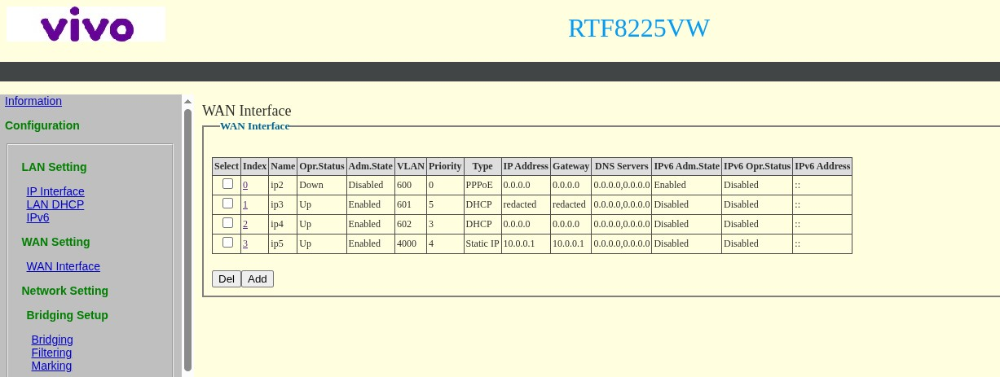
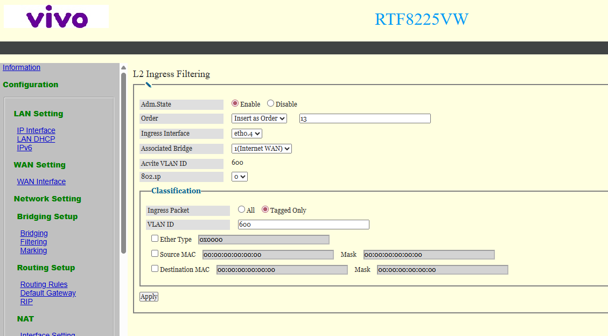

# MikroTik Dual WAN - ECMP + FastTrack

> Esse é meu setup pessoal de rede. Tá tudo rodando na minha casa, mas foi feito pras minhas necessidades, não é um projeto genérico plug-and-play. Se quiser usar como base pro seu, fica à vontade. Copia, adapta, quebra, conserta. É assim que se aprende.

Scripts pra RouterOS v7: dual WAN com load balancing ECMP + FastTrack, failover automático, VPN WireGuard com full tunnel, Pi-Hole como DNS, DHCP estático com hostnames `.internal`, traffic steering por dispositivo e hardening de segurança.

Rodando com **Vivo (PPPoE) + Claro (DHCP/CGNAT)** num hEX S (RB760iGS).

## O que faz

- **Load balancing ECMP**: distribui conexões entre as duas WANs automaticamente
- **FastTrack**: conexões estabelecidas vão direto pelo hardware, sem passar pelo firewall (~900Mbps no hEX S)
- **Failover automático**: se um ISP cair, o tráfego migra pro outro em ~10 segundos
- **WireGuard VPN**: acesso remoto à rede de casa de qualquer lugar, com full tunnel e DDNS
- **Pi-Hole DNS**: DHCP entrega o Pi-Hole como DNS primário, com fallback pra Cloudflare
- **DHCP estático + hostnames**: IPs fixos por MAC e nomes `.internal` (ex: `ping meupc.internal`)
- **Traffic steering**: força dispositivos específicos a usar um ISP, com fallback pro outro
- **Firewall + hardening**: bloqueia acesso externo, rate limit de SYN/ICMP, anti-spoofing, serviços desnecessários desabilitados
- **PPPoE e DHCP**: scripts auxiliares pra Vivo (PPPoE/bridge) e Claro (DHCP/CGNAT)
- **Monitor de ISP**: loga mudanças de estado, opcionalmente manda email

## Requisitos

- MikroTik com **RouterOS v7.20+**
- 5 portas ethernet (2 WAN + 3 LAN) ou mais
- Winbox, WebFig ou SSH
- Pi-hole (opcional)
- *Muita* paciência e persistência pra deixar tudo redondo

Testado em: hEX S (RB760iGS), RB750Gr3

## Como usar

### 1. Script principal

1. Baixe o `mikrotik-dual-wan-ecmp.rsc`
2. Edite as variáveis no topo (interfaces, IPs, MACs, timezone)
3. Remova as seções marcadas com `[OPCIONAL]` que não precisa
4. Suba no router (Winbox > Files > arrastar) e importe:

```
/import mikrotik-dual-wan-ecmp.rsc
```

> **CUIDADO**: o script reseta toda a configuração do router. Conecte fisicamente, não faça isso por VPN/remoto. Backup antes: `/export file=backup`

5. Troque a senha admin:

```
/user set admin password=SUA-SENHA-FORTE
```

### 2. Scripts auxiliares (opcionais)

Suba a pasta `scripts/` no router e importe o que precisar:

| Script | O que faz | Quando usar |
|--------|-----------|-------------|
| `scripts/wireguard-setup.rsc` | WireGuard VPN com DDNS e full tunnel | Quer acessar sua rede de fora |
| `scripts/wireguard-rollback.rsc` | Remove toda configuração WireGuard | Quer desfazer a VPN |
| `scripts/vivo-pppoe.rsc` | Troca Vivo de DHCP pra PPPoE | Colocou a Vivo em bridge |
| `scripts/vivo-dhcp-rollback.rsc` | Reverte Vivo pra DHCP | Quer voltar a Vivo pro modo roteador |
| `scripts/claro-static-restore.rsc` | Configura IP estático na Claro | Claro em bridge não entrega IPv4 |
| `scripts/claro-dhcp-rollback.rsc` | Remove estático e reativa DHCP | Quando o lease da Claro expirar |
| `scripts/claro-sfp-swap.rsc` | Troca modem Claro em ether2 por SFP GPON stick em sfp1 | Tirar o modem do caminho |
| `scripts/claro-sfp-swap-rollback.rsc` | Volta pro modem Claro em ether2 | Desfazer o swap do stick |
| `scripts/dns-optimization.rsc` | Redireciona DNS pro Pi-Hole + bloqueia DoT | Quer forçar todo DNS pelo Pi-Hole |

## Verificação

```
# DHCP pegou IP dos ISPs?
/ip dhcp-client print

# Duas rotas ECMP ativas?
/ip route print where dst-address=0.0.0.0/0

# FastTrack processando tráfego?
/ip firewall filter print stats where comment~"FastTrack"

# Log do monitor
/log print follow where message~"MONITOR"
```

## Testar failover

Puxa o cabo de uma WAN. Em ~10 segundos a rota desativa e o tráfego vai pela outra. Reconecta e volta automaticamente.

## Seções opcionais

O script principal tem seções marcadas com `[OPCIONAL]` que você pode remover:

| Seção | O que faz | Quando remover |
|-------|-----------|----------------|
| DHCP Leases Estáticos | IPs fixos por MAC | Não precisa de IP fixo |
| DNS Hostnames | Nomes `.internal` | Não quer acessar dispositivos por nome |
| Traffic Steering | Força dispositivo pra um ISP | Não precisa direcionar tráfego |
| Email | Alertas de queda/retorno por email | Não quer notificações |
| Monitor de ISP | Log de estado dos ISPs | Não quer monitoramento |
| Monitor de Memória | Alerta de memória alta | Não quer monitoramento |

## Bridge mode

O script assume que os ISPs entregam IP via DHCP. Funciona com os modems em **modo roteador** (double NAT) -- pra uso residencial é OK, mas convenhamos: se você chegou até este projeto, só OK não é o suficiente -- ou em **bridge**.

### Claro em bridge

A Claro com OLT ZTE pode não reconhecer o MAC do seu roteador e não entregar IPv4. Sintoma: só IPv6 funciona, DHCP fica em `requesting` pra sempre.

**Solução 1: IP estático temporário**
1. Antes de ativar bridge, anote no modem: IP público, gateway e máscara (Status > WAN)
2. Coloque o modem em bridge
3. Configure a WAN do MikroTik com IP estático usando os dados anotados (a internet vai funcionar)
4. Quando parar de funcionar (lease expirou), troque de volta pra DHCP
5. A partir daí o DHCP funciona normalmente

Scripts auxiliares pros passos 3 e 4:
- `scripts/claro-static-restore.rsc` configura o IP estático
- `scripts/claro-dhcp-rollback.rsc` remove estático e reativa DHCP

**Solução 2: Clonar MAC**
Clone o MAC da WAN do modem Claro na interface WAN do MikroTik antes de ativar bridge.

### Claro via SFP GPON stick (sem modem)

Se quiser tirar o modem Claro do caminho, dá pra plugar um SFP GPON stick direto na `sfp1` do MikroTik. Elimina equipamento, consumo e dependência de firmware Claro travado.

Testado com **ODI DFP-34X-2C2** + **Claro + OLT ZTE**. Outros sticks podem funcionar, desde que suportem clonagem de GPON SN, Vendor ID e parâmetros OMCI.

#### Pré-requisitos

1. SFP GPON stick compatível com o OLT ZTE da Claro
2. Anotar do modem Claro original (aba *Status > Device Info* + etiqueta física) — valores são só exemplos ilustrativos do formato, os seus vão ser diferentes:

   | Campo | Formato / Exemplo fake |
   |---|---|
   | `GPON SN` | 4 ASCII (vendor) + 8 hex (serial), ex: `ZTEGAABBCCDD` |
   | `Vendor ID` | 4 chars ASCII, ex: `ZTEG` |
   | `Product Class` | modelo do modem, ex: `F6600P` |
   | `HW Version` | ex: `V1.0.0` |
   | `SW Version` | ex: `V1.2.3P4N5` |
   | `Device Serial Number` | valor completo da UI do modem, ex: `AABBCC1234567890ABCDEF1234` |
   | `ONT MAC` | da etiqueta, ex: `AA:BB:CC:DD:EE:FF` |
   | `OUI` | primeiros 3 bytes do ONT MAC, ex: `AABBCC` |

3. DHCP client da Claro ativo na ether2 antes do swap (estado normal)
4. Acesso físico pra trocar cabos

#### Passo 1: Configurar o stick

1. Pluga o stick em `sfp1` **sem fibra**
2. Pra link Ethernet subir sem sinal óptico, força `sfp-ignore-rx-los=yes`:

```
/interface ethernet set sfp1 sfp-ignore-rx-los=yes
```

3. Cria acesso temporário à UI do stick (`http://192.168.1.1`):

```
/ip address add address=192.168.1.10/24 interface=sfp1 comment="Access GPON stick (temp)"
/ip firewall nat add chain=srcnat src-address=192.168.100.0/24 out-interface=sfp1 action=masquerade comment="NAT to GPON stick (temp)"
```

4. Abre `http://192.168.1.1` no browser e preenche os valores anotados. Tem 2 forms na página `gpon.asp`:
   - Form superior: `GPON SN` (deixa LOID/PLOAM default)
   - Form inferior: `Vendor ID`, `SW Version 1/2`, `Product Class`, `HW Version`, `Device Serial Number`, `MAC` (ONT MAC sem `:`, minúsculo), `OUI` (3 primeiros bytes do ONT MAC), `Fiber Reset: Disable`

5. Salva cada form clicando no *Apply Changes* correspondente
6. **CRÍTICO**: `Apply Changes` só persiste em RAM. Pra gravar em flash vai em `Admin > Commit/Reboot` e clica **Commit** (ou Save+Reboot). Sem esse passo, tudo some no próximo reboot do stick.

> ⚠️ **Não plugue/desplugue a fibra 5 vezes seguidas** — o stick reseta pros defaults e você perde a config.

#### Passo 2: Rodar o swap

```
/import scripts/claro-sfp-swap.rsc
```

O script clona o MAC da `ether2` no `sfp1` (preserva lease DHCP no OLT), move o DHCP client pro `sfp1`, atualiza a WAN interface-list e desabilita a `ether2`.

#### Passo 3: Swap físico

1. Desconecta o cabo copper do modem Claro da `ether2`
2. Desconecta a fibra do modem Claro
3. Conecta a fibra no SFP GPON stick (`sfp1`)
4. Espera 30-60s pra autenticação GPON + DHCP

#### Verificação

```
/interface ethernet monitor sfp1 once    # sfp-rx-loss: no, status: link-ok
/ip dhcp-client print where name=client2 # status=bound
/tool ping 1.1.1.1 interface=sfp1 count=3
/ip route print where dst-address=0.0.0.0/0 and active
```

Pra confirmar que o stick autenticou no OLT, loga no `http://192.168.1.1` (se ainda tiver acesso temporário configurado) e checa em `Status > PON`. Status code **`05`** (O5) = registrado com sucesso.

#### Rollback

```
/import scripts/claro-sfp-swap-rollback.rsc
```

E inverte os passos físicos (fibra de volta no modem, copper na ether2).

#### Se DHCP não pegar lease em 2 min

Provável VLAN no lado do OLT (varia por região; o deploy onde testamos é untagged). Tentar as comuns:

```
/interface vlan add interface=sfp1 vlan-id=10 name=vlan10-sfp1
/ip dhcp-client set [find where name=client2] interface=vlan10-sfp1
```

VLANs comuns em Claro/ZTE: `10`, `20`, `100`. Se nada funcionar, rodar rollback e investigar o modem.

### Vivo em bridge (PPPoE)

A Vivo usa PPPoE, não DHCP. Precisa configurar o modem pra passar PPPoE por uma porta LAN pro MikroTik.

#### Passo 1: Acessar a página avançada do modem

Modems Vivo (Askey, Mitrastar, etc.) bloqueiam o acesso às configurações avançadas. Pra desbloquear:

1. Desconecte a fibra óptica do modem
2. Conecte um PC por cabo no modem
3. Acesse `192.168.15.1/instalador` com usuário `support` e a senha da etiqueta
4. Mude a região pra outra (VIVO2 → VIVO1) e aplique. O modem reseta.
5. Acesse `192.168.15.1/padrao` pra confirmar acesso (não mexa em nada ainda)
6. Volte em `192.168.15.1/instalador` e restaure a região original. Reseta de novo.
7. Agora acesse `192.168.15.1/padrao` com `support` e configure
8. Desative gerenciamento remoto: Manutenção > TR-069 Client > CWMP > Desativar
9. Reconecte a fibra óptica

#### Passo 2: Configurar bridge por porta no modem

Em `192.168.15.1/padrao`:

1. WAN Setting > WAN Interface: **desabilite** a conexão PPPoE (ip2, VLAN 600)

   
2. Bridging > Filtering (L2 Ingress Filtering)
3. Encontre a porta LAN que vai no MikroTik (ex: `eth0.4` = LAN4)
4. Edite: Associated Bridge = `1(Internet WAN)`, VLAN ID = `600`, Adm.State = Enable

   
5. Salve

A porta LAN4 agora recebe os frames PPPoE direto da fibra. Seu modem vai funcionar como uma simples ONU sem a necessidade de trocar o equipamento.
As outras portas e WiFi (se habilitado) continuam ativos, mas servem só pra gerenciar o modem.

#### Passo 3: Ativar PPPoE no MikroTik

Conecte a ether1 do MikroTik na porta LAN4 do modem Vivo e importe:

```
/import scripts/vivo-pppoe.rsc
```

Credenciais padrão: `cliente@cliente` / `cliente` (pode variar por região).
A VLAN depende da região: Vivo2 usa VLAN 600. Confira em WAN Setting > WAN Interface no modem.

```
/interface pppoe-client print    # deve mostrar R (RUNNING)
/ip route print where dst-address=0.0.0.0/0    # rota PPPoE ativa
/tool ping 1.1.1.1 interface=pppoe-vivo count=3
```

Se não conectar, tente clonar o MAC da WAN do modem na ether1: `/interface ethernet set ether1 mac-address=XX:XX:XX:XX:XX:XX`

Pra reverter: `/import scripts/vivo-dhcp-rollback.rsc` e reabilite ip2 no modem.

## WireGuard VPN (acesso remoto)

Acesse sua rede de casa de qualquer lugar: celular, notebook, tanto faz. O tráfego passa por um túnel criptografado até o MikroTik e sai pela sua internet. Ideal pra WiFi público, 4G, hotel, aeroporto.

Requer pelo menos uma WAN com IP público (sem CGNAT). Não usa login/senha. A autenticação é por chaves criptográficas: quem não tem a chave nem recebe resposta do servidor.

```
/import scripts/wireguard-setup.rsc
```

O script configura tudo (DDNS, WireGuard, firewall, NAT) e imprime as instruções.

### O que o script faz

- Ativa DDNS gratuito da MikroTik (hostname fixo que acompanha o IP dinâmico)
- Força tráfego do DDNS pela WAN com IP público (com ECMP + CGNAT, o DDNS pode travar se sair pela WAN errada)
- Cria interface WireGuard na porta UDP 13231
- Abre porta no firewall só na interface da WAN pública
- Libera tráfego VPN pra LAN e internet (full tunnel)
- NAT pro tráfego VPN sair pela internet de casa

### Configuração do cliente

1. Instale o app **WireGuard** (Android/iOS/Windows/Linux)
2. Crie um túnel novo (o app gera as chaves)
3. Configure a **Interface**:
   - **Endereço**: `10.0.0.2/32`
   - **DNS**: `1.1.1.1` (ou IP do Pi-Hole)
4. Adicione um **Peer**:
   - **Chave pública**: pegue do MikroTik (`/interface wireguard print`)
   - **Endpoint**: `<seu-ddns>.sn.mynetname.net:13231` (veja com `/ip cloud print`)
   - **IPs permitidos**: `0.0.0.0/0` (todo tráfego pela VPN)
   - **Keepalive persistente**: `25`
5. No MikroTik, adicione o peer:
   ```
   /interface wireguard peers add interface=wireguard1 public-key="CHAVE_DO_CLIENTE" allowed-address=10.0.0.2/32 comment="Peer: Celular"
   ```
6. Ative o túnel e teste: `http://10.0.0.1`

Cada dispositivo usa um IP diferente: celular = `.2`, notebook = `.3`, etc.

Pra remover: `/import scripts/wireguard-rollback.rsc`

## Let's Encrypt SSL

Certificado HTTPS gratuito via ACME direto no MikroTik. Usa o DDNS do IP Cloud como domínio. Útil pra HTTPS no WebFig e pra exportar o certificado pro seu servidor na LAN.

```
/import scripts/letsencrypt-setup.rsc
```

O script:
1. Habilita DDNS (IP Cloud)
2. Abre porta 80 temporariamente pra validação HTTP-01
3. Solicita certificado Let's Encrypt (aguarda ~3 minutos)
4. Fecha porta 80
5. Aplica no WebFig HTTPS
6. Cria scripts no router: `letsencrypt-export` e `letsencrypt-renew`
7. Cria scheduler diário que abre porta 80 quando faltam menos de 20 dias pra expirar

### Exportar certificado (PEM)

Pra usar o certificado num servidor na LAN (Nginx, Caddy, etc.):

```
/system script run letsencrypt-export
```

Gera dois arquivos em Files: `.crt` (certificado) e `.key` (chave privada, criptografada com passphrase `changeme`). Baixe via SCP ou Winbox.

Pra descriptografar a chave:
```bash
openssl rsa -in cert_export_*.key -out key_decrypted.pem
```

Pra remover tudo: `/import scripts/letsencrypt-rollback.rsc`

## Regras bogon

O firewall bloqueia IPs privados vindos da WAN (anti-spoofing). Se seu ISP entrega IP privado (ex: 192.168.x.x no modo roteador), desabilite a regra:

```
/ip firewall raw disable [find where comment~"192.168"]
```

## Licença

MIT

## Créditos

Fork de [vishnunuk/mikrotik-dual-wan-loadbalance-failover](https://github.com/vishnunuk/mikrotik-dual-wan-loadbalance-failover). Adaptado com brasileiridades.
